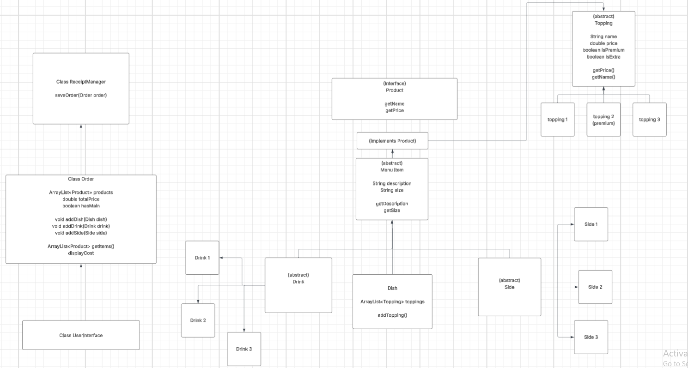

# 
Oops! All Magic

## 
Code Flow Concept

| Interface        | Purpose                                                         |
|------------------|-----------------------------------------------------------------|
| 
 Product | 
 Covers all classes that have a name and price variable |

| Abstract Classes  | Purpose                                                                                                                     |
|-------------------|-----------------------------------------------------------------------------------------------------------------------------|
| 
 MenuItem | 
 Implements Product interface and acts as a parent for Side, Elixir, and Potion                                     |
| 
 Elixir   | 
 Extends MenuItem class and acts as a parent for SundropSpritz, ThunderMead, and GarlicJuice                        |
| 
 Side     | 
 Extends MenuItem class and acts as a parent for DragonScaleChips, PhoenixFeatherFries, and ToadstoolBites          |
| 
 Topping  | 
 Implements Product interface and acts as a parent to any product classes that should not be orderable individually |

| Classes                 | Purpose                                                                                                                                                                                                                 |
|-------------------------|-------------------------------------------------------------------------------------------------------------------------------------------------------------------------------------------------------------------------|
| 
 Potion         | 
 Extends MenuItem class. This class contains "ArrayList<Topping> toppings" and has the option to be large, medium, or small and "flavored" as a health, stamina, or strength potion. This makes up my main dish |
| 
 Order          | 
 Interacts with the UserInterface and holds any created MenuItems in an ArrayList<MenuItems>                                                                                                                    |
| 
 UserInterface  | 
 Handles screens and user inputs. On start(), a new Order object is created and nagivating the screens will allow users to constomize and save their order                                                      |
| 
 FileManagement | 
 When saveReceipt() is called on an Order object, a JSON object is dynamically created and saved to the resources/receipts file and a receipt with order information is generated using the AsciiTable library  |
